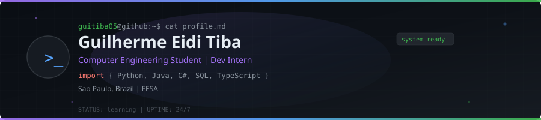

<div align="center">
  
</div>

<br/>

# 👋 Olá! Sou o Guilherme

🎓 Estudante de **Engenharia de Computação** na **FESA**  
💼 **Estagiário em Desenvolvimento**  
📍 **São Paulo, Brasil**

```python
class Guilherme:
    def __init__(self):
        self.focus   = ["Back-end", "Automation", "Web Dev"]
        self.stack   = ["Python", "Java", "C#", "SQL", "TypeScript"]
        self.learning = "Sempre evoluindo"
    
    def greet(self):
        return "Transformando ideias em codigo!"
```

<br/>

### 🤝 Vamos nos conectar?

<p align="center">
  <a href="http://linkedin.com/in/guilherme-eidi-tiba" target="_blank">
    
  </a>
  <a href="https://github.com/guitiba05" target="_blank">
    
  </a>
  <a href="mailto:guilhermeeiditiba@gmail.com">
    
  </a>
</p>

---

### 🛠️ Tech Stack

<p align="center">
  
  
  
  
  
  
  
  
  
  
  
  
</p>

---

### 📊 GitHub Analytics

<p align="center">
  
  
</p>

<p align="center">
  
</p>

---

### 🐍 Contribution Graph

<div align="center">
  <picture>
    <source media="(prefers-color-scheme: dark)" srcset="https://github.com/guitiba05/guitiba05/blob/output/github-contribution-grid-snake-dark.svg">
    <source media="(prefers-color-scheme: light)" srcset="https://github.com/guitiba05/guitiba05/blob/output/github-contribution-grid-snake.svg">
    
  </picture>
</div>

---

### 🎧 Currently Vibing

<p align="center">
  <a href="https://spotify-github-profile.vercel.app/api/view?uid=guilhermeeiditiba&redirect=true">
    
  </a>
</p>

---

### 📌 Recent GitHub Activity

<!--RECENT_ACTIVITY:start-->
<!--RECENT_ACTIVITY:end-->

<!--RECENT_ACTIVITY:last_update-->
<!--RECENT_ACTIVITY:last_update_end-->

---

### 📈 Weekly Development Breakdown

<!--START_SECTION:waka-->
<!--END_SECTION:waka-->

---

<div align="center">
  
  
  <br/>
  <br/>
  
  <em>⚡ "Transformando ideias em código, um commit de cada vez."</em>
</div>
